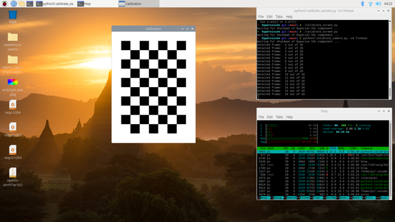
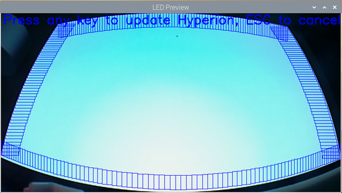

# HyperVision

Have you ever dreamed of using your *webcam* with [Hyperion](https://github.com/hyperion-project/hyperion.ng)
to set up those Ambient LED strips for your TV/monitor?

Did you wonder how to do that, given geometric distortions from the camera?

Perhaps you even itched to put a camera with a [Fisheye lens](https://en.wikipedia.org/wiki/Fisheye_lens)
right next to your monitor, like in some
[commercial](https://us.govee.com/products/immersion-tv-backlights)
[systems](https://ambivision.tv/) (but to do it better 😛)?

Well, here is a simple solution!

## Setup

0.  Use a computer capable of running Python 3 scripts in graphical mode - this could be your Raspberry Pi 😉

1.  Install [Hyperion.NG](https://docs.hyperion-project.org/en/user/Installation.html) and navigate to its web UI (`http://<server-ip>:8090`).

2.  *Disable* "Local Admin API Authentication" under *Configuration -> Network Services* in Hyperion Web UI - unfortunately,
    this step is [needed](https://github.com/hyperion-project/hyperion.ng/issues/1251) to control Hyperion from our scripts.
    You can re-enable it later, if you want.

    Also, *disable* "Platform Capture" under *Configuration -> Capturing Hardware*.

3.  Install Python dependencies:
    ```
    pip3 install -r requirements.txt
    ```

4.  Turn off the lights. Seriously, this really helps with calibration! Your monitor should be the brightest object in the room.

5.  Put your camera in front of the monitor, but not overly close, so it could see the entire screen
    (for fisheye, don't place it right in front just yet). Then, run this script:
    ```
    python3 calibrate_camera.py
    ```
    (for fisheye, add `-cm fisheye` option).

    This script will display a live preview from the camera, which should help with positioning.
    Once you have the entire screen within the field of view, press any key.

    Then, it'll show a [chessboard calibration pattern](https://docs.opencv.org/master/dc/dbb/tutorial_py_calibration.html),
    and measure camera parameters while varying its position on the screen:

    

    If all goes well, the results will be stored in `params.json` file. Easy so far!

6.  Place the camera to its more permanent position - could be as close as several inches from the monitor
    (if you like to live on the edge with a fisheye 😛). Then, run:
    ```
    python3 calibrate_screen.py
    ```
    (you can also specify the number of LEDs at each edge of the screen etc.)

    As previously, this will show a live preview, so you can pick the best spot for the camera.

    Once you press a key, it will take measurements from a blank screen and offer you the final preview
    of the calculated LED positions with a cropped screen:

    

    Hit Esc key if you want to cancel, or any other key to update Hyperion with your new settings!

7.  That's it! PROFIT (and don't forget to turn on your lights...)

If you later reposition the camera, only re-run step 6 and you're good to watch the lights again!

## Disclaimer

This is still a work-in-progress. As you can see, LED alignment is not yet OCD-perfect, and some
corner areas fall outside the screen.

Another disclaimer is that the closer you put the camera to the screen, the lesser area
there's to measure actual intensity of LEDs. In fact, the rectangles we generate
for Hyperion are approximations themselves, since Hyperion doesn't support "skewed" areas.

We'll work to improve some of these things, but in the meantime, this should be a good start!
